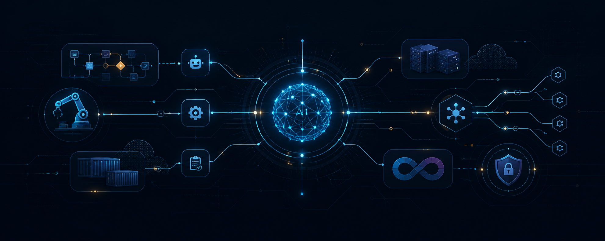

# Hi, eu sou Arthur Days 👋

### AI-Native Software Engineer · Agentic Systems · Automation

Construo software com uma stack de IA: agentes colaborativos, modelos generativos, automações e práticas modernas de engenharia para transformar requisitos em sistemas funcionais, seguros e documentados.

Meu foco atual é transformar problemas reais em sistemas simples de operar, observáveis e seguros — usando IA como parte do processo de engenharia, não apenas como uma camada de interface.

## Áreas de atuação

- **AI Agents:** desenho de agentes, prompting, memória, ferramentas e integração com modelos.
- **Automation:** workflows com n8n, RPA e integrações entre serviços.
- **APIs & Back-end:** Node.js, Express, autenticação, bancos de dados e documentação OpenAPI.
- **Full-Stack:** JavaScript, Python, interfaces responsivas e Progressive Web Apps.
- **Security:** autenticação, validação de entrada, rate limiting e práticas de desenvolvimento seguro.
- **DevOps:** Docker, GitHub Actions, testes automatizados e pipelines de entrega.

## Projetos em destaque

| Projeto | O que demonstra | Tecnologias |
| --- | --- | --- |
| [Protocol Intelligence](https://github.com/ArthurDays/dashboard-protocolos) | Plataforma AI-native de protocolos com triagem agentic explicável, confiança, guardrails, revisão humana auditável, SLA e CI | React, TypeScript, Fastify, Prisma, PostgreSQL, Vitest, Docker, GitHub Actions |
| [NeoBank API](https://github.com/ArthurDays/banking-api) | API bancária full-stack com autenticação JWT, transações, PIX, documentação e assistente com IA | Node.js, Express, SQLite, Jest, Docker, GitHub Actions, Gemini |
| [Óptima Digital](https://github.com/ArthurDays/OptimaAi) | Plataforma web de marketing e automação com foco em performance, qualidade e experiência mobile | JavaScript, Tailwind CSS, PWA, Jest, TDD |
| [Boa Noite, Mãe](https://github.com/ArthurDays/n8n-projeto-good-night) | Workflow multiagente que cria texto e imagem com IA e envia a composição pelo WhatsApp | n8n, Gemini, Groq, OpenAI, Evolution API |

## Como eu construo

```text
Problema real → arquitetura enxuta → implementação assistida por IA
             → testes e segurança → automação da entrega → aprendizado contínuo
```

Valorizo documentação que permite reproduzir o projeto, decisões técnicas explícitas e automações que continuem compreensíveis depois que saem do protótipo.

## AI Engineering Stack

| Camada | Competências e ferramentas |
| --- | --- |
| **AI Development** | Codex, GitHub Copilot e desenvolvimento orientado por agentes |
| **Models** | OpenAI, Gemini e Groq |
| **Agentic Systems** | agentes, ferramentas, memória, prompting e workflows multiagente |
| **Automation & Integration** | n8n, RPA, APIs, webhooks e integrações com WhatsApp |
| **Software Engineering** | arquitetura, autenticação, testes, segurança e documentação |
| **Delivery** | Docker, GitHub Actions e CI/CD |
| **Languages & Runtime** | JavaScript, Node.js, Python e SQL — escolhidos conforme o problema |

> Linguagens e frameworks são ferramentas de implementação. O foco é projetar e entregar soluções completas com engenharia de software e IA aplicada.

## Contato

- [LinkedIn](https://www.linkedin.com/in/arthur-days)
- [GitHub](https://github.com/ArthurDays)

---

Aberto a colaborar em projetos de software, IA aplicada e automação.
